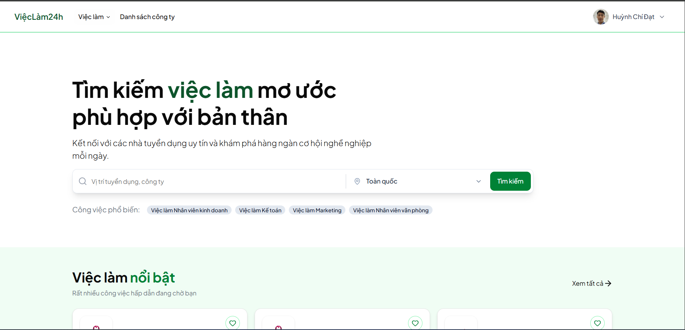

# Việc Làm 24h - Hệ thống quản lý và đăng tin tuyển dụng

Việc Làm 24h là một nền tảng tuyển dụng trực tuyến toàn diện, đóng vai trò cầu nối giữa nhà tuyển dụng và ứng viên. Hệ thống cung cấp các công cụ mạnh mẽ để doanh nghiệp dễ dàng đăng tin, quản lý hồ sơ ứng tuyển, đồng thời mang đến trải nghiệm tìm kiếm việc làm mượt mà và trực quan cho người lao động.



## Tính năng nổi bật

**Dành cho Ứng viên:**
* Tìm kiếm việc làm theo từ khóa, ngành nghề, và khu vực.
* Tạo và quản lý hồ sơ cá nhân (Profile/CV).
* Ứng tuyển nhanh chóng vào các vị trí mong muốn.
* Theo dõi trạng thái hồ sơ đã ứng tuyển.

**Dành cho Nhà tuyển dụng:**
* Đăng ký tài khoản doanh nghiệp.
* Đăng tải, chỉnh sửa và quản lý các tin tuyển dụng.
* Xem xét, đánh giá và quản lý danh sách CV của ứng viên.

**Dành cho Quản trị viên:**
* Quản lý tài khoản người dùng (Ứng viên & Nhà tuyển dụng).
* Kiểm duyệt các tin tuyển dụng trước khi hiển thị.
* Thống kê số liệu hệ thống.

## Công nghệ sử dụng

* **Frontend:** ReactJS, Tailwind CSS, Shadcn/ui, Framer Motion.
* **Backend:** Node.js, Express.js.
* **Database:** PostgreSQL.
* **DevOps & Triển khai:** Docker.
* **Khác:** Git, GitHub, JWT cho bảo mật xác thực.

## Hướng dẫn cài đặt

Dự án này đã được "Docker hóa" (Dockerized), giúp bạn chạy toàn bộ ứng dụng (Frontend, Backend, Database) chỉ với một dòng lệnh duy nhất mà không cần cài đặt môi trường phức tạp.

### Các yêu cầu bắt buộc
* [Docker](https://docs.docker.com/get-docker/) và [Docker Compose](https://docs.docker.com/compose/install/) đã được cài đặt trên máy.
* Git.

## Cài đặt

1. Clone reposistory về máy:

```bash
   git clone https://github.com/dathuynh0/ViecLam24h.git
   cd ViecLam24h
```
2. Thiết lập biến môi trường:

* Tạo file `.env` tại thư mục `server`
```env
    PORT=8080
    DATABASE_DB=vieclam24h_db
    USERNAME_DB=postgres
    PASSWORD_DB=mypassword
    PORT_DB=5432
    HOST_DB=db 
    ACCESS_TOKEN_SECRET=token_secret
    CLIENT_URL=http://localhost:5173
    GOOGLE_CLIENT_ID=google_client_id
    GOOGLE_CLIENT_SECRET=google_client_secret
    GOOGLE_CALLBACK_URL=callback_url
```

* Tạo file `.env.production` trong thư mục `client`
```env
    VITE_BACKEND_URL=url_backend
```

* Tạo file `.env` tại thư mục chứa file `docker-compose.yml`
```env
    DB_USER=postgres
    DB_PASSWORD=mypassword
    DB_NAME=vieclam24h_db
    JWT_SECRET=doancongnghephanmennhom68
    JWT_REFRESH_SECRET=doancongnghephanmennhom68
    VITE_API_URL=url_api
```

3. Build và khởi chạy container:

```bash
    docker-compose up -d --build
```

4. Truy cập ứng dụng:

* **Frontend (Giao diện người dùng):** `http://localhost:5173` (hoặc port bạn đã cấu hình)
* **Backend (API):** `http://localhost:8080` (hoặc port bạn đã cấu hình)

### Dừng và xóa Containers

Khi không sử dụng, bạn có thể dừng và xóa các containers đang chạy bằng lệnh:
```bash
docker-compose down
```

### Thành viên thực hiện
* **Huỳnh Chí Đạt** MSSV: 110123086
* **Huỳnh Phan Vân Anh** MSSV: 110123065
* **Thạch Nguyễn Quế Anh** MSSV: 110123068